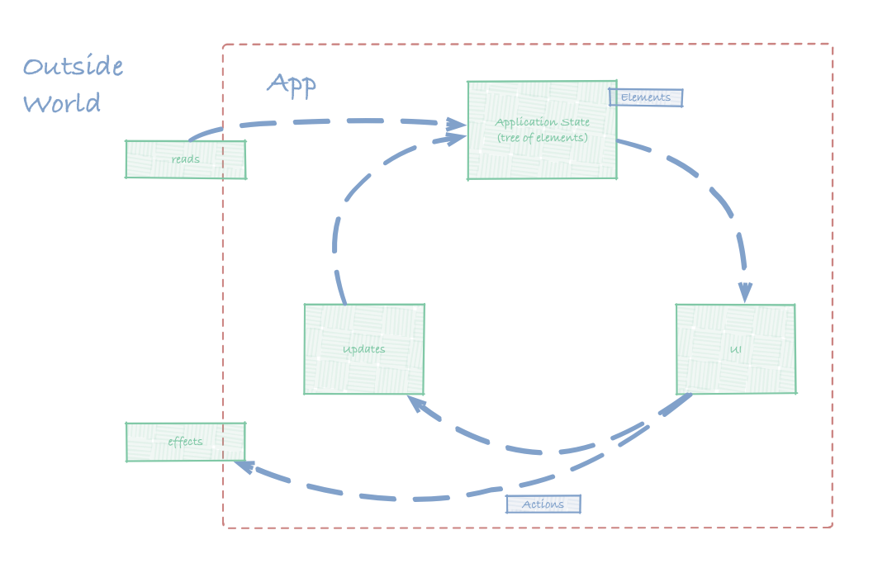

# girders-elements

[](https://travis-ci.org/netceteragroup/girders-elements)
[](https://coveralls.io/github/netceteragroup/girders-elements?branch=master)

Girders Elements is an architectural framework that assists building
**data-driven** apps with **[React](https://facebook.github.io/react/)** or
 **[React Native](https://facebook.github.io/react-native/)**.
It is extremely well-suited for creating highly **dynamic UIs**,
that are driven by back-end systems (like Content Management Systems).

It uses **[redux](http://github.com/reactjs/redux)** for managing the state of
the application. All great tools around the redux eco-system can be leveraged,
because **Girders Elements** builds on top of it.

**[Immutable](https://facebook.github.io/immutable-js/)** data structures are
used to represent the application state. This allows for a substantially more
efficient `shouldComponentUpdate` implementation compared to **react-redux**.
[Immutable's implementation][persistent-data-structures] also allows for
more efficient (space and time-wise) changes to the application state. This
makes the framework well suited for mobile application use.

[persistent-data-structures]: https://github.com/facebook/immutable-js/#immutable-collections-for-javascript
### Installation

```
npm install --save @girders-elements/core
```
or
```
yarn add @girders-elements/core
```

You will also need to add `react`, `redux`,`react-dom` / `react-native`
to your project's dependencies.

### Overview

A Girders Elements app, in rough terms, works by

- mapping a well defined data structure (a single tree of polymorphic elements)
  to an user interface
- having a well defined way how to get data from the "outside world" into that tree
- having a well defined way how to change that data structure based on user
  interaction
- having a way how to affect the outside world



### Application State

The app keeps a central **application state** (in a redux store) with the following
characteristics:

- it is a well defined **polymorphic tree**
- each node in the tree is an **element**, essentially an object *tagged* by
  a `kind` property
- Each node / element contains all the essential information necessary to
  construct a user interface.

Example:

```javascript
{
  "kind": "__app",
  "entryPoint": {
    "kind": "vertical-container",
    "children": [
      {
        "kind": "teaser",
        "imageUrl": "http://spyhollywood.com/wp-content/uploads/2016/06/sherlock.jpg"
        "title": "Sherlock Holmes"
      },
      {
        "kind": ["teaser", "small"],
        "imageUrl": "http://spyhollywood.com/wp-content/uploads/2016/06/sherlock.jpg",
        "imageUrlSmall": "http://spyhollywood.com/wp-content/uploads/2016/06/sherlock-small.jpg"        
        "title": "Another Sherlock Holmes Teaser"        
      }
    ]
  }
}
```

[application-state]: #application-state

#### The Element's Kind

The `kind` property of an element:

- serves as a **tag**; data objects of the same "type" are tagged with
  the same `kind`
- determines which properties are inside that element
- determines which (if any) sub-elements are there

The `kind` can be a simple string. E.g.

```javascript
{
  "kind": "teaser",
  "imageUrl": "http://spyhollywood.com/wp-content/uploads/2016/06/sherlock.jpg"
  "title": "Sherlock Holmes"
}
```

I the he above example, the element is of the kind `teaser`. Elements of the
kind `teaser` have the properties `imageUrl` and `title`.

Element kind **specialization** is supported as well. Specialized kinds are
represented using array notation:


```javascript
{
  "kind": ["teaser", "small"],
  "imageUrl": "http://spyhollywood.com/wp-content/uploads/2016/06/sherlock.jpg",
  "imageUrlSmall": "http://spyhollywood.com/wp-content/uploads/2016/06/sherlock-small.jpg"
  "title": "Sherlock Holmes"
}
```

In the above example, the the element is of the kind `['teaser', 'small']`.
This kind is *a specialization of* the kind `['teaser']`.

Note that the kinds `'teaser'` and `['teaser']` are **equivalent**. The array
form is the *canonical representation*.

There is one rule that is followed when using *specializations*: **Elements of a
more specialized kind must contain all the properties that are required for the
more general kind**.

Following this rule, `['teaser', 'small']`, being a specialization of `['teaser']`
must contain all the properties that are required for `['teaser']`. It therefore
provides the `imageUrl` property (required for `['teaser']`), but it adds an
`imageUrlSmall` property as well.

This is a requirement that enables **forward compatibility** of the data feeds
/ APIs. As the backend can evolves, it sends *more specialized* forms of older
elements. The clients (usually mobile apps with an update process over which we
have no precise control) with an older version of the app can still correctly
interpret the newer data feeds.

This is enabled by the [Element UI Resolution](#ui-resolution) process described
below.

### UI

The UI of an element can be any React Component that takes three
props: `element`, `dispatch` and `uiFor`.

- The `element` is an immutable.js structure representing the data model
  (sub-tree) of the specific element in the application state
- The `dispatch` is the standard redux dispatcher for dispatching actions
- The `uiFor` property is a function that is used to render the UI of sub-elements.

We register the UI for an element by using:

    ui.register(<element-kind>, <element>)

Following the [example we used so far][application-state], we can define the UI
for the element of kind `teaser` the following way:

```javascript
ui.register('teaser', ({ element }) =>
  <View>
    <Image source={{uri: element.get('imageUrl')}} />
    <Text>{element.get('title')}</Text>
  </View>
);
```

The code essentially states: *whenever an element of the kind `teaser` needs to
be presented, use the following component to materialize the UI for it*.

#### Rendering of sub - elements

An element (such as the `__app` in the example we are running with) can have
one or more children that are also elements. When rendering such an element
one must take care to render its children properly.

This is done via the `uiFor` property passed to the element's UI:

```javascript
ui.register('__app', ({ element, uiFor }) =>
  <div id="app">
    {uiFor('entryPoint')}
  </div>
);
```

Here we are specifying the UI for [our top-level element][application-state]
(root element). The `__app` has an `entryPoint` property which is an element of
any kind. By invoking `uiFor('entryPoint')` we are asking Girders Elements to
produce the UI for the element under the property `entryPoint` for us.  

`uiFor` can be used to render a list of elements as well:

```javascript
ui.register('vertical-container', ({ element, uiFor }) =>
  <div class="vertical-container">
    {uiFor('children')}
  </div>
);
```

Here, we are registering the UI for the element of kind `vertical-container`
from [our example][application-state]. This element has a `children` property,
which is a list of elements (of varying kind). By invoking `uiFor` on this
property we are asking Girders Elements to render the ui for all the elements
in this list, using the appropriate UI for each of those elements.

`uiFor` can also be called with a a key-path:

```javascript
ui.register('__app', ({ uiFor }) =>
  <div class="app">
    {uiFor(['entryPoint', 'children', 0])}
  </div>
);
```

Here, in the UI for `__app`, we are are asking Girders Elements to render the
UI for the first element of the `children` of `entryPoint` of the current
element.

#### UI Resolution

Whenever Girders Elements encounters a request to present a UI for some element

1. it will try to find the UI using the requested element first
2. if it doesn't find an UI, it will try with **a more general kind**
3. if it doesn't find a UI for it, it will try with **an even more general kind**
4. and so on, until an UI is found or there are no *more general* kinds to be
   derived from the current one.

Given the kind `['teaser', 'small', 'new']`, the following statement holds true:

```
[] --  is more general kind of --> ['teaser']  --
   --> is more general kind of --> ['teaser', 'small'] --
   --> is more general kind of --> ['teaser', 'small', 'new']
```

So the resolution will

1. first look for an UI for `['teaser', 'small', 'new']`
2. if not found, it will look for an UI for `['teaser', 'small']`
3. if not found, it will look for an UI for `['teaser']`
4. if not found, it will look for an UI for `[]` (the empty kind)


#### Dispatching Actions

An action is just a string identifying what needs to be performed on the state. When one triggers an action, one can also supply additional parameters (payload) to the action that will be provided later on to the update.

The dispatch prop is used to dispatch an action. Actions can be
- **local** - meaning that the action will be handled by an updater for the element from which it was dispatched
- **global** - meaning that the action will be handled by an updater for the action that is either registered for the element from which the action was dispatched, or some of its parents

Global actions are identified by starting dot in the action type (for now, might change in near future).

### Update

Updates are registered in a similar way ui is registered, by using the element kind.

    update.register(<element-kind>, <update-definitions>)

Here is an example:

```javascript
update.register(['article'], elementRegistry => {
  elementRegistry.register('TOGGLE_BOOKMARK', (element, action) => element.set('bookmarked', element.get('bookmarked')));
  elementRegistry.register('.LOAD', (element, action) => element.set('data', action.payload.data));
})
```

In this example, for the `article` **element** we register two **updates**:
- a local update, in case `TOGGLE_BOOKMARK` is dispatch only from the `article` element, we change the `bookmarked` flag
- a global update, in case `.LOAD` is dispatch from the `article` element or any of its children

### Read

Reads are a standardaized way to bring data into you app. Most prominent use-case is fetching data from the back-end systems.

Reads are started by preparing:
- the **endpoint** from where the data is going to be fetched
- the **place** where you want the data to be stored (attached) when its successfully fetched

To kick-off a read, you create an **element** with the following structure, on the **place** where you want the data to be attached:

```javascript
{
  "kind": ["__read", "container", "teasers"],
  "uri": "http://www.mocky.io/v2/588333b52800006a31cbd4b9"
}
```

This **read** element, is being resolved, because the frame-work contains a default element registered for the kind `__read`. It doesn't render any UI. This element dispatches a special action and changes the kind to `["__load", "conatiner", "teasers"]`.

Again, there is a default element, registered for `__load`. It renders a loading spinner on the screen. It also disaptches a special action, that will perfrom the actuall fetching of the data. If the data is fetched successfully, then the data will be stored in the node named `children`, and the first element in the kind array will be removed. This will essentially transform the data to:

```javascript
{
  "kind": ["container", "teasers"],
  "uri": "",
  "children": [
    {
      "kind":[
         "teaser",
         "image"
      ],
      "imageUrl":"http://spyhollywood.com/wp-content/uploads/2016/06/sherlock.jpg",
      "title":"Sherlock Holmes"
    },
    {
      "kind":[
         "teaser",
         "image"
      ],
      "imageUrl":"http://img15.deviantart.net/6ee0/i/2010/286/2/2/dr__watson_by_elenutza-d30o87s.png",
      "title":"Dr. Watson"
    }
  ]
}
```

In case error happens, the kind is transormed to `["__error", "container", "teasers"]` and some meta information about the error is stored. The system has an element registered for the kind with `__error` that presents this information.

The elements registered with kinds `__load` and `__error`, are good examples for customiziable elemetns, that you will most probably over-ride with a more specific element kind. When that is done, you need to preserve the behaviour for the process to still continue to work.

### Engine

The Engine is your App.js. You use it to bootstrap an app based on `girders-elements`. It is a React Component that you pass the `initState` prop:

```javascript
const initState = {
  kind: ['app', 'teasers'],
  content: {
    kind: ['__read', 'container', 'teasers'],
    uri: 'http://www.mocky.io/v2/588333b52800006a31cbd4b9'
  }
}

// main render
<Engine initState={initState} />
```
